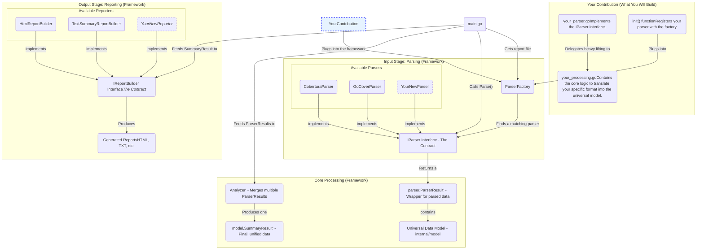

### 1. Architectural Diagram: Parsers and Reporters

This diagram shows the complete data flow, from input files to final reports. It highlights the "pluggable" nature of both parsers (for input) and report builders (for output). The section you need to build is clearly marked.



#### What this diagram shows:

*   **Fixed Framework:** The components in the grey boxes are part of the core application. You should not need to modify their interfaces (`IParser`, `IReportBuilder`) or core logic (`Analyzer`, `main.go`).
*   **Your Scope (Blue Box):** Your entire task is to create a new "Available Parser" that fulfills the `IParser` contract.
*   **Extensibility:** The system is designed to accept multiple parsers for input and use multiple report builders for output. The factories and interfaces are the glue that holds it all together.
*   **Data Flow:** The process is linear: `main` orchestrates everything, the `ParserFactory` picks your parser, your parser creates the `Universal Data Model`, the `Analyzer` merges it, and the `ReportBuilders` consume it to create files.

---

### 2. The `IParser` Interface: Your Contract

This is the most important part. Your new parser **must** implement this interface, which is defined in `internal/parser/parser_config.go`.

| Method | Responsibility | Implementation Notes |
| :--- | :--- | :--- |
| **`Name() string`** | Return the unique name of your parser (e.g., "GoCover", "JaCoCo"). | This is used in logs, so make it descriptive. |
| **`SupportsFile(filePath string) bool`** | Quickly determine if your parser can handle this file. | **This must be fast.** Read only the first few bytes or lines to check for a "magic string" (e.g., `mode: set`) or a specific XML root element. Do *not* read the entire file here. |
| **`Parse(filePath string, config ParserConfig) (*ParserResult, error)`** | Read the entire report file and convert it into the `parser.ParserResult` struct, which contains the universal `model` objects. | This is where the main translation logic resides. You have access to filters (`config.FileFilters()`, etc.) to exclude data during parsing. |

---

### 3. Boilerplate Templates for a New Parser

Follow this structure to create a parser for a new format (e.g., `yourformat`).

#### 3.1. Create the Directory and Files

1.  Create a new directory: `internal/parser/yourformat/`
2.  Create the following two files inside it:
    *   `parser.go`
    *   `processing.go`

#### 3.2. `parser.go` Template

This file implements the `IParser` interface and registers the parser.

```go
// path: internal/parser/yourformat/parser.go

package yourformat

import (
	"fmt"
	"os"

	"github.com/IgorBayerl/ReportGenerator/go_report_generator/internal/parser"
	"github.com/IgorBayerl/ReportGenerator/go_report_generator/internal/model" // You will need this
)

// YourFormatParser implements the IParser interface.
type YourFormatParser struct {
	// Add dependencies here if needed for testing, e.g., a file reader mock.
}

// NewYourFormatParser creates a new YourFormatParser.
func NewYourFormatParser() parser.IParser {
	return &YourFormatParser{}
}

// init registers this parser with the central parser factory.
// This function is automatically called by Go when the package is imported.
func init() {
	parser.RegisterParser(NewYourFormatParser())
}

// Name returns the unique, human-readable name of the parser.
func (p *YourFormatParser) Name() string {
	// TODO: Replace with the actual name of your format.
	return "YourFormat"
}

// SupportsFile checks if the given file is in "YourFormat".
func (p *YourFormatParser) SupportsFile(filePath string) bool {
	// TODO: Implement a FAST and EFFICIENT check for your file format.
	// For text files, read the first line. For XML, check the root element.
	// Example for a text file checking the first line:
	/*
		file, err := os.Open(filePath)
		if err != nil {
			return false
		}
		defer file.Close()
		scanner := bufio.NewScanner(file)
		if scanner.Scan() {
			return strings.HasPrefix(scanner.Text(), "your_format_magic_string:")
		}
		return false
	*/
	
	// Return a placeholder value for now.
	return false 
}

// Parse processes the report file and transforms it into a ParserResult.
func (p *YourFormatParser) Parse(filePath string, config parser.ParserConfig) (*parser.ParserResult, error) {
	// 1. Read the raw file content.
	content, err := os.ReadFile(filePath)
	if err != nil {
		return nil, fmt.Errorf("failed to read file %s: %w", filePath, err)
	}

	// 2. Delegate the complex processing logic to keep this file clean.
	processor := newYourFormatProcessor(config)
	assemblies, sourceDirs, err := processor.Process(content)
	if err != nil {
		return nil, fmt.Errorf("failed to process data from %s: %w", filePath, err)
	}

	// 3. Populate the ParserResult with the data from your processor.
	// TODO: Adjust these boolean/nil values based on what your format supports.
	return &parser.ParserResult{
		Assemblies:             assemblies,
		SourceDirectories:      sourceDirs,
		SupportsBranchCoverage: false, // Set to true if your format has branch data.
		ParserName:             p.Name(),
		MinimumTimeStamp:       nil,   // Set if your format provides a timestamp.
		MaximumTimeStamp:       nil,
	}, nil
}
```

#### 3.3. `processing.go` Template

This file contains the internal logic for translating the report format into the application's data model.

```go
// path: internal/parser/yourformat/processing.go

package yourformat

import (
	"fmt"
	"log/slog"
	
	"github.com/IgorBayerl/ReportGenerator/go_report_generator/internal/model"
	"github.com/IgorBayerl/ReportGenerator/go_report_generator/internal/parser"
	"github.com/IgorBayerl/ReportGenerator/go_report_generator/internal/utils"
	"github.com/IgorBayerl/ReportGenerator/go_report_generator/internal/filereader"
)

// yourFormatProcessor handles the transformation of YourFormat data.
type yourFormatProcessor struct {
	config parser.ParserConfig
}

// newYourFormatProcessor creates a new processor.
func newYourFormatProcessor(config parser.ParserConfig) *yourFormatProcessor {
	return &yourFormatProcessor{
		config: config,
	}
}

// Process is the main entry point for the processor.
// It takes the raw file content and returns the populated model and source directories.
func (p *yourFormatProcessor) Process(content []byte) (assemblies []model.Assembly, sourceDirs []string, err error) {
	// ==========================================================================================
	// TODO: This is where your main implementation work happens.
	// The goal is to return a `[]model.Assembly`.
	// ==========================================================================================

	// Step 1: Parse `content` into temporary structs that match your format.
	// This helps separate raw parsing from the translation logic.
	// e.g., rawData, err := unmarshalYourFormat(content)

	// Step 2: Create a single `model.Assembly`. Most non-.NET formats map well to one assembly.
	// You can derive the assembly name from a project file (like go.mod) or use a default.
	assembly := model.Assembly{
		Name:    "DefaultAssemblyName", // TODO: Determine a sensible assembly name.
		Classes: []model.Class{},
	}

	// Step 3: Loop through the logical groupings in your format (e.g., packages, modules).
	// These will become `model.Class` instances.
	// for _, rawPackage := range rawData.Packages {

		// Step 3.1: Apply class filters early.
		// if !p.config.ClassFilters().IsElementIncludedInReport(rawPackage.Name) { continue }
		
		class := model.Class{
			Name:        "your.package.name", // TODO: Use the name from your format.
			DisplayName: "your.package.name",
			Files:       []model.CodeFile{},
		}

		// Step 4: Loop through the files within that logical group.
		// These will become `model.CodeFile` instances.
		// for _, rawFile := range rawPackage.Files {

			// Step 4.1: Apply file filters.
			// if !p.config.FileFilters().IsElementIncludedInReport(rawFile.Path) { continue }

			// Step 4.2: Resolve the absolute path to the source file.
			fullPath, err := utils.FindFileInSourceDirs("path/to/your/file.ext", p.config.SourceDirectories())
			if err != nil {
				slog.Warn("Source file not found, coverage data will be shown without source code.", "file", "path/to/your/file.ext", "error", err)
				fullPath = "path/to/your/file.ext" // Fallback to original path
			}

			// Step 4.3: Process the coverage data for this file to create a slice of `model.Line`.
			lines, covered, coverable, total := p.processFileLines(fullPath, nil /* pass raw coverage data for this file */)

			codeFile := model.CodeFile{
				Path:           fullPath,
				Lines:          lines,
				CoveredLines:   covered,
				CoverableLines: coverable,
				TotalLines:     total,
			}
			class.Files = append(class.Files, codeFile)

			// Step 4.4: Aggregate metrics from the file up to the class.
			// class.LinesCovered += codeFile.CoveredLines; etc.
		// }

		// Step 5: If the class has any files after filtering, add it to the assembly.
		// if len(class.Files) > 0 {
		//    assembly.Classes = append(assembly.Classes, class)
		//    // Aggregate metrics from the class up to the assembly.
		// }
	// }
	
	// Final result to be returned.
	assemblies = []model.Assembly{assembly}
	return assemblies, sourceDirs, nil
}

// processFileLines is an example helper to build the model.Line slice for a given file.
func (p *yourFormatProcessor) processFileLines(filePath string, coverageData interface{}) (lines []model.Line, coveredLines int, coverableLines int, totalLines int) {
	// TODO: Implement the logic to create the line-by-line analysis.

	// 1. Read the actual source code file to get its content and total line count.
	sourceCodeLines, err := filereader.ReadLinesInFile(filePath)
	if err != nil {
		slog.Warn("Could not read source file content.", "file", filePath, "error", err)
	}
	totalLines = len(sourceCodeLines)

	// 2. Create a map of line number -> hits from your `coverageData`.
	// lineHits := make(map[int]int)
	// for ... { lineHits[lineNumber] = visitCount }

	// 3. Determine the maximum line number to iterate up to.
	// maxLineNum := totalLines 
	// (may need to be larger if coverage report has lines beyond file length)

	// 4. Iterate and create a `model.Line` for each line.
	// for i := 1; i <= maxLineNum; i++ {
	// 	line := model.Line{
	// 		Number: i,
	// 		Hits: -1, // Default to NotCoverable
	// 	}
	// 	if i <= len(sourceCodeLines) { line.Content = sourceCodeLines[i-1] }
	// 	
	// 	if hits, ok := lineHits[i]; ok {
	// 		line.Hits = hits
	// 		coverableLines++
	// 		if hits > 0 { coveredLines++ }
	// 	}
	//
	//	line.LineVisitStatus = determineLineVisitStatus(line.Hits, ...)
	// 	lines = append(lines, line)
	// }
	
	return lines, coveredLines, coverableLines, totalLines
}

// This is a common utility function you will need.
func determineLineVisitStatus(hits int, isBranchPoint bool, coveredBranches int, totalBranches int) model.LineVisitStatus {
	if hits < 0 { return model.NotCoverable }
	if isBranchPoint {
		if totalBranches == 0 { return model.NotCoverable }
		if coveredBranches == totalBranches { return model.Covered }
		if coveredBranches > 0 { return model.PartiallyCovered }
		return model.NotCovered
	}
	if hits > 0 { return model.Covered }
	return model.NotCovered
}
```

### Summary of Your Tasks:

1.  **Create Your Package:** Make a new directory `internal/parser/yourformat/`.
2.  **Implement `parser.go`:**
    *   Copy the `parser.go` template.
    *   Change the parser `Name()`.
    *   Implement the `SupportsFile()` method with a fast check.
3.  **Implement `processing.go`:**
    *   Copy the `processing.go` template.
    *   This is the main task. Write the logic to read your report format's `content` and translate it into the `model.Assembly` structure.
    *   Pay close attention to how `model.CodeFile` and `model.Line` are populated, as this drives the visual reports.
4.  **Write Tests:** Create a `_test.go` file for your parser. Add sample report files to a `testdata` directory and write tests that parse them and assert that the resulting `model` structs are populated correctly.
5.  **You're Done!** The framework will automatically pick up and use your new parser for any matching files.